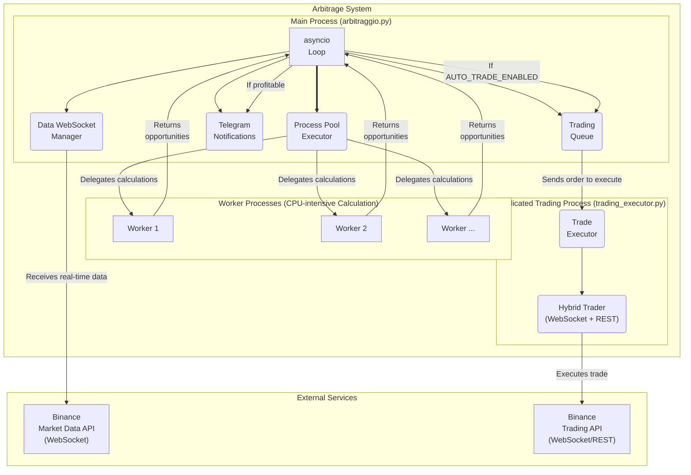

# Triangular Arbitrage Bot for Binance

This project is an advanced bot for detecting and (optionally) executing triangular arbitrage opportunities on the Binance cryptocurrency exchange. The bot connects to real-time market data streams, calculates thousands of potential arbitrage paths per second, and implements a series of strategic and technical filters to identify and, if enabled, execute only realistic opportunities.

## Architecture and Design

The bot is built on a high-performance hybrid architecture that leverages the best of concurrent programming in Python to maximize efficiency and stability.

### Architectural Diagram



### 1. `asyncio` for Network I/O
The core of the program is managed by `asyncio`. This allows it to handle hundreds of simultaneous Input/Output operations with extreme efficiency, such as:
- Keeping multiple WebSocket connections with Binance open and receiving data.
- Sending notifications to the Telegram API without "freezing" the rest of the program.
- Executing ultra-fast trading via a dedicated WebSocket connection.
- Managing periodic tasks like hourly summaries.

### 2. `ProcessPoolExecutor` for Intensive Calculations
Analyzing arbitrage opportunities is a CPU-intensive operation. To avoid blocking the `asyncio` loop, these calculations are delegated to a **separate process pool**. This allows the bot to leverage all CPU cores for heavy computations, while the main thread remains free and responsive to manage the network and trading.

### 3. Graph-Based Approach for Efficiency
Unlike a brute-force approach, this bot implements a much smarter logic based on **graph theory**:
1.  **Graph Construction:** At the beginning of each cycle, the bot builds a "map" of direct connections (trading pairs) between all currencies.
2.  **Efficient Navigation:** The worker processes explore **only and exclusively 3-step trading paths that actually exist on the market**, eliminating millions of useless calculations and focusing CPU power only on analyzing concrete opportunities.

## Features and Filters

The bot's effectiveness lies in its ability to filter out market "noise" and identify valid trades.

### Technical Simulation Filters
Each potential triangle is subjected to a realistic simulation that must pass the following checks for each "leg" of the path:
- **Liquidity:** The required quantity for the trade must be available on the order book at the best price (best bid/ask).
- **`minQty`:** The traded quantity must be above the minimum threshold required by Binance.
- **`minNotional`:** The total value of the trade (quantity x price) must exceed the minimum notional value.
- **`stepSize`:** The traded quantity is rounded down to comply with the required decimal precision.

### Optimal Amount Analysis
For each profitable opportunity identified, the bot performs an additional analysis to determine the **maximum safely investable amount**.
- **Calculation:** The maximum executable quantity is calculated for each step of the triangle, considering the liquidity available at the first level of the order book.
- **Safety Buffer:** To avoid slippage, a conservative buffer (e.g., 80%) is applied to the available quantity.
- **Logging:** The calculated optimal amount and the available volumes for each pair are saved in the log file, providing crucial data to assess the real feasibility of the opportunity.

## Automated Trading (Hybrid WebSocket/REST)

The bot includes an optional module for automatic trade execution, designed for maximum speed and safety.

- **Hybrid Mode:** It primarily uses a **WebSocket connection to place orders**, drastically reducing latency compared to traditional REST APIs. In case of WebSocket connection failure, the system automatically **falls back to the REST API** to ensure execution.
- **Dedicated Process:** Trade execution occurs in a completely separate process with its affinity set to a dedicated CPU core, to avoid being influenced or slowed down by market analysis.
- **Safety:**
  - Automated trading is **disabled by default** and must be explicitly enabled in the configuration file.
  - A **Dry Run (Testnet) mode** is available, allowing the entire trading logic to be tested on the Binance testnet without using real funds.
  - In case of an intermediate trade failure, an **emergency liquidation** function attempts to immediately sell the purchased assets to return the capital to the starting currency.

## Centralized Configuration

All key settings for the bot have been centralized in the `config.py` file for easy and safe management. This includes:
- Enabling auto-trading and testnet mode.
- Binance and Telegram API credentials.
- Performance parameters like the profit threshold, simulation budget, and the interval between analysis cycles.
- CPU core allocation for analysis and trading processes.

## Statistics and Logging
For maximum transparency, the bot provides a detailed statistical summary at the end of each analysis cycle. Opportunity logs are saved in `profitable_opportunities.txt` with UTF-8 encoding.

## Installation and Setup

1.  **Clone the Repository**
    ```bash
    git clone https://github.com/tech-and-finance/ArbitraggioTriangolare.git
    cd ArbitraggioTriangolare
    ```

2.  **Create a Virtual Environment**
    ```bash
    python -m venv venv
    ```
    On Windows:
    ```powershell
    .\venv\Scripts\Activate.ps1
    ```
    On macOS/Linux:
    ```bash
    source venv/bin/activate
    ```

3.  **Install Dependencies**
    ```bash
    pip install -r requirements.txt
    ```

4.  **Configure `config.py`**
    Open the `config.py` file and enter your API credentials (if you want to enable trading) and the desired parameters.

5.  **Start the Bot**
    ```bash
    python arbitraggio.py
    ```
---
*Disclaimer: This tool is provided for educational and experimental purposes only. Cryptocurrency trading involves significant risks. The author assumes no responsibility for any financial losses. Use at your own risk.* 