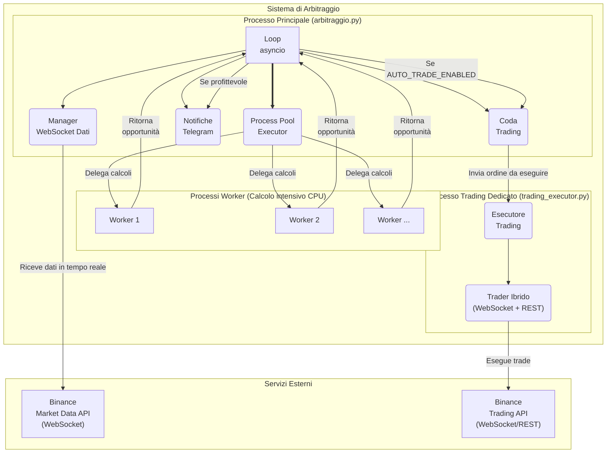

# Bot di Arbitraggio Triangolare per Binance

Questo progetto è un bot avanzato per il rilevamento e l'esecuzione (opzionale) di opportunità di arbitraggio triangolare sull'exchange di criptovalute Binance. Il bot si connette in tempo reale ai flussi di dati di mercato, calcola migliaia di potenziali percorsi di arbitraggio al secondo e implementa una serie di filtri strategici e tecnici per identificare e, se abilitato, eseguire solo le opportunità realistiche.

## Architettura e Design

Il bot è costruito su un'architettura ibrida ad alte prestazioni che sfrutta il meglio della programmazione concorrente in Python per massimizzare l'efficienza e la stabilità.

### Diagramma Architetturale



### 1. `asyncio` per l'I/O di Rete
Il cuore del programma è gestito da `asyncio`. Questo gli permette di gestire in modo estremamente efficiente centinaia di operazioni di Input/Output simultaneamente, come:
- Mantenere aperte e ricevere dati da multiple connessioni WebSocket con Binance.
- Inviare notifiche all'API di Telegram senza "congelare" il resto del programma.
- Eseguire il trading ultra-veloce tramite una connessione WebSocket dedicata.
- Gestire task periodici come i riepiloghi orari.

### 2. `ProcessPoolExecutor` per i Calcoli Intensivi
L'analisi delle opportunità di arbitraggio è un'operazione che richiede un uso intensivo della CPU. Per non bloccare il loop di `asyncio`, questi calcoli vengono delegati a un **pool di processi separati**. Questo permette al bot di sfruttare tutti i core della CPU per i calcoli pesanti, mentre il thread principale rimane libero e reattivo per gestire la rete e il trading.

### 3. Approccio a Grafo per l'Efficienza
A differenza di un approccio a forza bruta, questo bot implementa una logica molto più intelligente basata sulla **teoria dei grafi**:
1.  **Costruzione del Grafo:** All'inizio di ogni ciclo, il bot costruisce una "mappa" delle connessioni dirette (coppie di trading) tra tutte le valute.
2.  **Navigazione Efficiente:** I processi worker esplorano **solo ed esclusivamente percorsi di trading a 3 passi che esistono realmente sul mercato**, eliminando milioni di calcoli inutili e concentrando la potenza della CPU solo sull'analisi di opportunità concrete.

## Funzionalità e Filtri

L'efficacia del bot risiede nella sua capacità di scartare il "rumore" di mercato e identificare operazioni valide.

### Filtri Tecnici di Simulazione
Ogni potenziale triangolo viene sottoposto a una simulazione realistica che deve superare i seguenti controlli per ogni "gamba" del percorso:
- **Liquidità:** La quantità richiesta per il trade deve essere disponibile sull'order book al miglior prezzo (best bid/ask).
- **`minQty`:** La quantità scambiata deve essere superiore alla soglia minima richiesta da Binance.
- **`minNotional`:** Il valore totale del trade (quantità x prezzo) deve superare il valore nozionale minimo.
- **`stepSize`:** La quantità scambiata viene arrotondata per difetto per rispettare la precisione decimale richiesta.

### Analisi dell'Importo Ottimale
Per ogni opportunità profittevole identificata, il bot esegue un'analisi aggiuntiva per determinare l'**importo massimo investibile** in modo sicuro.
- **Calcolo:** Viene calcolata la quantità massima eseguibile per ogni step del triangolo, considerando la liquidità disponibile al primo livello dell'order book.
- **Buffer di Sicurezza:** Per evitare lo slippage, viene applicato un buffer conservativo (es. 80%) sulla quantità disponibile.
- **Logging:** L'importo ottimale calcolato e i volumi disponibili per ogni coppia vengono salvati nel file di log, fornendo dati cruciali per valutare la reale fattibilità dell'opportunità.

## Trading Automatico (Ibrido WebSocket/REST)

Il bot include un modulo opzionale per l'esecuzione automatica dei trade, progettato per la massima velocità e sicurezza.

- **Modalità Ibrida:** Utilizza primariamente una connessione **WebSocket per piazzare ordini**, riducendo drasticamente la latenza rispetto alle tradizionali API REST. In caso di fallimento della connessione WebSocket, il sistema esegue automaticamente un **fallback all'API REST** per garantire l'esecuzione.
- **Processo Dedicato:** L'esecuzione del trading avviene in un processo completamente separato con affinità impostata su un core della CPU dedicato, per non essere influenzato o rallentato dall'analisi del mercato.
- **Sicurezza:**
  - Il trading automatico è **disabilitato di default** e deve essere attivato esplicitamente nel file di configurazione.
  - È presente una modalità **Dry Run (Testnet)** che permette di testare l'intera logica di trading sulla testnet di Binance senza usare fondi reali.
  - In caso di fallimento di un'operazione intermedia, una funzione di **liquidazione d'emergenza** tenta di rivendere immediatamente gli asset acquistati per riportare il capitale alla valuta di partenza.

## Configurazione Centralizzata

Tutte le impostazioni chiave del bot sono state centralizzate nel file `config.py` per una gestione semplice e sicura. Questo include:
- Abilitazione del trading automatico e della modalità testnet.
- Credenziali API di Binance e Telegram.
- Parametri di performance come la soglia di profitto, il budget di simulazione e l'intervallo tra i cicli di analisi.
- Allocazione dei core della CPU per i processi di analisi e trading.

## Statistiche e Logging
Per la massima trasparenza, il bot fornisce un riepilogo statistico dettagliato alla fine di ogni ciclo di analisi. I log delle opportunità vengono salvati in `profitable_opportunities.txt` con codifica UTF-8.

## Installazione e Avvio

1.  **Clonare il Repository**
    ```bash
    git clone https://github.com/tech-and-finance/ArbitraggioTriangolare.git
    cd ArbitraggioTriangolare
    ```

2.  **Creare un Ambiente Virtuale**
    ```bash
    python -m venv venv
    ```
    Su Windows:
    ```powershell
    .\venv\Scripts\Activate.ps1
    ```
    Su macOS/Linux:
    ```bash
    source venv/bin/activate
    ```

3.  **Installare le Dipendenze**
    ```bash
    pip install -r requirements.txt
    ```

4.  **Configurare `config.py`**
    Apri il file `config.py` e inserisci le tue credenziali API (se vuoi abilitare il trading) e i parametri desiderati.

5.  **Avviare il Bot**
    ```bash
    python arbitraggio.py
    ```

---
*Disclaimer: Questo strumento è fornito a scopo educativo e sperimentale. Il trading di criptovalute comporta rischi significativi. L'autore non si assume alcuna responsabilità per eventuali perdite finanziarie. Usare a proprio rischio.* 